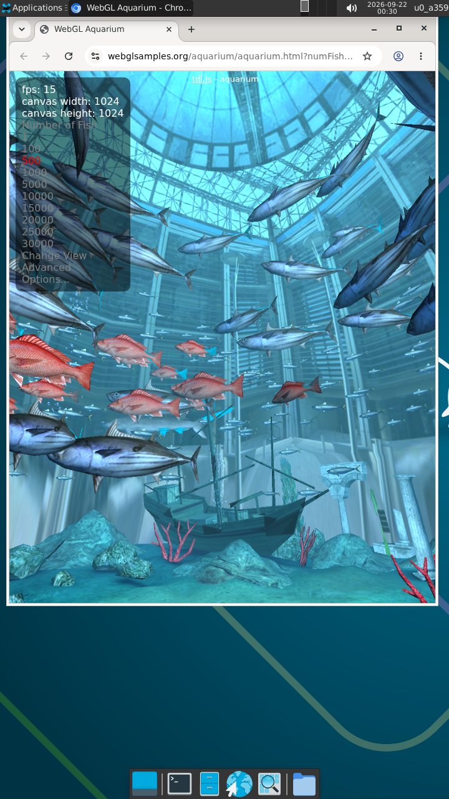

# Mesa PanVK Mali-G57 — kbase JM / Android

Experimental Mesa PanVK Vulkan driver for **ARM Mali-G57 MC2 / Valhall** using the Arm **kbase JM (Job Manager)** interface on Android / Termux.

> [!NOTE]
> This driver enables hardware-accelerated Vulkan on Mali-G57 inside Termux:X11 without requiring Linux mainline DRM/KMS `panfrost.ko`.

---

## Target Hardware & Environment
* **GPU:** ARM Mali-G57 MC2 (MediaTek Dimensity / Helio SoCs)
* **Architecture:** Valhall v9 (Job Manager / JM)
* **Kernel Driver:** ARM `kbase` (`/dev/mali0`, uAPI JM 11.38 / 11.46)
* **Environment:** Android / Termux
* **Display Server:** Termux:X11 (via MIT-SHM `userbuf` import)
* **Driver:** Mesa PanVK (`libvulkan_panfrost.so`)

---

## Confirmed Working & Benchmarks

* **Device & Queue:** Mali-G57 MC2 detection, device initialization, queue creation via `kbase` JM uAPI.
* **WSI / Display:** Termux:X11 swapchain presentation via `userbuf` host import and MIT-SHM blit.
* **Benchmarks:**
  * `vkmark 2025.01` (Hardware Mali-G57):
    * `[clear] <default>`: **119 FPS** (8.403 ms)
    * `[cube]  <default>`: **88 FPS** (11.364 ms)
  * **WebGL & Real-World Browser Graphics:**
    * **Broad Sample Compatibility:** Verified loading and running almost all official test demos from [webglsamples.org](https://webglsamples.org/) on this device (dynamic lighting, shaders, textures, reflections, and particle systems).
    * **WebGL Aquarium (500 Fishes at 1024x1024 Canvas):**
      * **PanVK:** **15–25 FPS** (peak ~26 FPS, real-time interactive rendering)
      * **VirGL (`virpipe`):** **~3 FPS** (flat-lined hard bottleneck due to socket IPC serialization)
      * Delivers a **5x–8x real-world speedup** over VirGL.

<p align="center">
  
  <br>
  <em>Live Capture: WebGL Aquarium running inside Chromium on Termux:X11 with PanVK hardware acceleration on ARM Mali-G57 MC2.</em>
</p>

---

## Key Hardware Patches & Fixes

1. **Termux:X11 WSI Presentation (`wsi_common_x11.c`):**
   * Implements host memory import (`userbuf`) and MIT-SHM blits.
   * Bypasses strict Linux DRI3 explicit sync checks to allow smooth X11 presentation.
2. **Valhall JM Silent Fragment Hang Workaround (`panvk_vX_cmd_meta.c`):**
   * Workaround for a Valhall JM hardware issue where multi-layer instanced blits in `vk_meta` caused the fragment stage to permanently deadlock.
   * Automatically splits multi-layer blits into safe $1 \times 1$ layer passes.
3. **Tilebuffer MSAA Resolve-on-Store (`panvk_vX_cmd_draw.c`):**
   * Resolves multisampled tilebuffers to single-sampled surfaces (`PAN_FB_MSAA_COPY_AVERAGE`).
   * Fixes black screens and corrupted output when resolving multisampled textures.
4. **Kbase Job Dispatch & Synchronization (`panvk_vX_gpu_queue_kbase.c`):**
   * Reworked atom completion loops, timeout handling, and memory barriers.
   * Silenced spammy per-draw memory hex dumps behind `PANVK_VERBOSE` to unlock real-time framerates.

---

## Building in Termux

### 1. Install Dependencies
```bash
pkg update
pkg install -y git meson ninja clang python libandroid-shmem-static \
               xorgproto libx11 libxcb libxshmfence vulkan-loader \
               vulkan-tools vkmark
```

### 2. Build the Driver
Run the build script:
```bash
./build_panvk.sh
```
Or manually run:
```bash
meson setup build-bionic \
  -Dbuildtype=release \
  -Dpanvk-use-kbase=true \
  -Dvulkan-drivers=panfrost \
  -Dgallium-drivers= \
  -Dplatforms=x11 \
  -Ddebug=false \
  -Dstrip=true \
  -Dbuild-tests=false \
  -Dc_link_args=-landroid-shmem \
  -Dcpp_link_args=-landroid-shmem \
  -Dpanfrost-kmds=kbase,panthor

ninja -C build-bionic src/panfrost/vulkan/libvulkan_panfrost.so
```

---

## Installation & Configuration

Install the ICD configuration for Termux's Vulkan loader:
```bash
./install_panvk.sh
```
Or manually create `$PREFIX/share/vulkan/icd.d/panfrost_icd.aarch64.json`:
```json
{
    "file_format_version": "1.0.1",
    "ICD": {
        "api_version": "1.3.354",
        "library_arch": "64",
        "library_path": "/full/path/to/build-bionic/src/panfrost/vulkan/libvulkan_panfrost.so"
    }
}
```

Verify the hardware driver is detected:
```bash
vulkaninfo --summary
```

---

## Standalone Tests

Test programs and shaders are provided in `tests/panvk-g57/`:

```bash
cd tests/panvk-g57

# Test direct kbase kernel ioctls
clang test_gpu_id.c -o test_gpu_id
./test_gpu_id

# Test X11 swapchain presentation (requires Termux:X11 running on DISPLAY=:0)
clang test_swapchain_g57.c -lxcb -lvulkan -o test_swapchain_g57
DISPLAY=:0 ./test_swapchain_g57

# Test full 3D terrain rendering pipeline
clang test_panvk_terrain.c -lxcb -lvulkan -lm -o test_panvk_terrain
DISPLAY=:0 ./test_panvk_terrain
```

---

## Running Benchmarks
Start your Termux:X11 desktop session and run:
```bash
DISPLAY=:0 vkmark
```

---

## Credits & Prior Art

This work builds directly on top of foundational research, forks, and patches from the open-source graphics community:

* **[Mesa 3D Project](https://gitlab.freedesktop.org/mesa/mesa):** The upstream Panfrost / PanVK driver developers.
* **[funnymdzz/mesa](https://github.com/funnymdzz/mesa):** Pioneered the initial `mali_kbase` kernel module backend and non-DRM device discovery on Android.
* **[leegao/mesa-funnymdzz](https://github.com/leegao/mesa-funnymdzz):** "panvk-over-kbase for Winlator", solving device enumeration and `pan_kmod_dev_create_with_driver` initialization without `/dev/dri`.
* **[mexicanbr0auth/mesa-panvk-g57](https://github.com/mexicanbr0auth/mesa-panvk-g57):** Experimental snapshot and base branch for Mali-G57 kbase/JM bringup.
* **[wonderkast02/panvk-g720-kbase-csf](https://github.com/wonderkast02/panvk-g720-kbase-csf):** Community discussions and reverse-engineering insights on Android Mali kbase interfaces.

---

*Made with AI.*

---

## License
Mesa source files retain their existing upstream licenses (MIT / X11). New modifications follow applicable Mesa licensing requirements.
