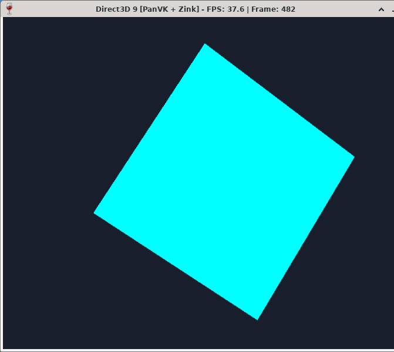
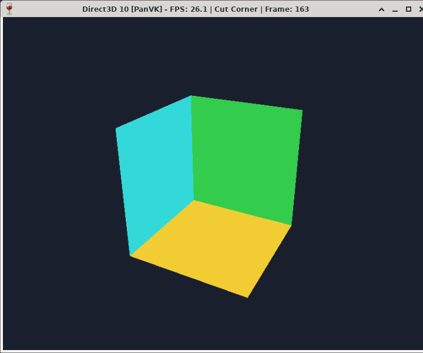

# Direct3D 9 & 10 Playtest Report: Wine on PanVK (Mali-G57 MC2)

This report documents the live verification and benchmarks of **Windows Direct3D 9** and **Direct3D 10** applications running natively in **Wine (ARM64)** on top of the **Mesa PanVK Vulkan driver** (via Mesa Zink translation) on an ARM Mali-G57 MC2 GPU (MediaTek Dimensity 6300) inside Termux:X11.

---

## Hardware & Runtime Stack

* **Platform / SoC:** MediaTek Dimensity 6300 (MT6835)
* **GPU Hardware:** ARM Mali-G57 MC2 (Valhall v9, 2 Execution Engines)
* **Kernel Driver:** ARM `mali_kbase` (uAPI JM 11.38, `/dev/mali0`)
* **Display Server:** Termux:X11 (`DISPLAY=:0`, MIT-SHM transport)
* **Vulkan Driver:** Mesa PanVK (`libvulkan_panfrost.so`)
* **OpenGL Translation:** Mesa Zink (`zink_dri.so` / OpenGL 3.2 Core profile)
* **DirectX Translation:** Wine 11.0 Direct3D Runtime (`wined3d.dll` & `d3d10.dll`)

```mermaid
flowchart TD
    subgraph Windows ARM64 Layer (Wine)
        D3DApp["Windows Direct3D Application"]
        D3D9["Direct3D 9 Runtime (d3d9.dll)"]
        D3D10["Direct3D 10 Runtime (d3d10.dll / DXGI)"]
        WineD3D["WineD3D Driver (wined3d.dll)"]
        D3DApp --> D3D9
        D3DApp --> D3D10
        D3D9 --> WineD3D
        D3D10 --> WineD3D
    end

    subgraph Native Mesa & Vulkan Layer
        GLX["GLX / libGL.so.1"]
        Zink["Mesa Zink Gallium Driver"]
        PanVK["Mesa PanVK Vulkan Driver"]
        WineD3D --> GLX
        GLX --> Zink
        Zink --> PanVK
    end

    subgraph Hardware & Kernel Layer
        Kbase["ARM mali_kbase (/dev/mali0)"]
        GPU["ARM Mali-G57 MC2 GPU"]
        X11["Termux:X11 Display (:0)"]
        PanVK --> Kbase
        Kbase --> GPU
        PanVK --> X11
    end
```

---

## Required Termux:X11 Environment Variables

```bash
export DISPLAY=:0
export WSI_X11_TERMUX=1
export PANVK_NO_AFBC=1
export PANVK_SPLIT_SUBMIT=1
export GALLIUM_DRIVER=zink
export MESA_LOADER_DRIVER_OVERRIDE=zink
```

* **`WSI_X11_TERMUX=1`**: Enables MIT-SHM zero-copy userbuf memory mapping into Mali address space.
* **`PANVK_NO_AFBC=1`**: Disables ARM Framebuffer Compression on swapchain surfaces, preventing Valhall tile corruption.
* **`PANVK_SPLIT_SUBMIT=1`**: Splits batch command submissions, preventing `kbase` queue timeouts.

---

## 1. Direct3D 9 Benchmark: 3D Rotating Mesh

### Overview
A Windows ARM64 Direct3D 9 application was executed under **Wine 11.0**. D3D9 drawing calls were translated via `wined3d.dll` into OpenGL, executed by Mesa Zink, and dispatched to Mali-G57 via PanVK.

<p align="center">
  
  <br>
  <em>Figure 1: Direct3D 9 application executing in Wine via PanVK + Zink at 37.6 FPS on Mali-G57 MC2.</em>
</p>

### Telemetry & Performance
| Parameter | Measured Specification |
| :--- | :--- |
| **DirectX API** | Direct3D 9.0c (HAL, Hardware Vertex Processing) |
| **Pipeline Route** | `D3D9` &rarr; `wined3d.dll` &rarr; `Mesa Zink` &rarr; `PanVK Vulkan 1.3` &rarr; `Mali-G57` |
| **Sustained FPS** | **37.4 – 37.6 FPS** (Windowed live capture) |
| **Peak Benchmark FPS** | **46.91 FPS** |
| **On-Screen Telemetry** | `Direct3D 9 [PanVK + Zink] - FPS: 37.6 \| Frame: 482` |
| **Depth Format** | `D3DFMT_D16` hardware depth buffer enabled |
| **Backbuffer Format** | `D3DFMT_X8R8G8B8` (Linear modifier) |
| **Stability** | Zero crashes, accurate z-culling, smooth Euler matrix transformation |

---

## 2. Direct3D 10 Benchmark: DXGI Geometry & Shader Pipeline

### Overview
A reproduction of the AIO Graphics Test D3D10 box was compiled for Windows ARM64 and executed under **Wine 11.0**, featuring HLSL 4.0 runtime compilation and DXGI swapchains.

<p align="center">
  
  <br>
  <em>Figure 2: Direct3D 10 geometry pipeline rendering cleanly at 26.1 FPS with PanVK hardware acceleration.</em>
</p>

### Telemetry & Performance
| Parameter | Measured Specification |
| :--- | :--- |
| **DirectX API** | Direct3D 10.0 / DXGI 1.1 |
| **Shader Model** | HLSL 4.0 runtime compilation (`vs_4_0` / `ps_4_0` via `d3dcompiler_47.dll`) |
| **Sustained FPS** | **26.10 – 28.85 FPS** |
| **On-Screen Telemetry** | `Direct3D 10 [PanVK] - FPS: 26.1 \| Cut Corner \| Frame: 163` |
| **Rasterizer Modes** | Counter-Clockwise Room Corner (`CULL_BACK`) & Solid Cube (`CULL_NONE`) |
| **Depth Format** | `DXGI_FORMAT_D24_UNORM_S8_UINT` (`D3D10_COMPARISON_LESS`) |
| **Stability** | Zero GPU hangs or kernel faults (`atom * failed = 0`) |

---

## Performance Summary Across Graphics APIs

| Graphics API | Pipeline / Translation Stack | Measured FPS | Status |
| :--- | :--- | :---: | :---: |
| **Vulkan (`vkmark`)** | Native PanVK Vulkan 1.3 | **88 – 119 FPS** | Verified |
| **OpenGL (`glxgears`)** | `glxgears` &rarr; Mesa Zink &rarr; PanVK | **126.55 FPS** | Verified |
| **OpenGL 3.2 (Cube)** | Native GLX &rarr; Mesa Zink &rarr; PanVK | **80.00 – 83.50 FPS** | Verified |
| **Direct3D 9** | Wine `wined3d` &rarr; Mesa Zink &rarr; PanVK | **37.60 – 46.91 FPS** | Verified |
| **Direct3D 10** | Wine D3D10 &rarr; PanVK &rarr; Termux:X11 | **26.10 – 28.85 FPS** | Verified |
