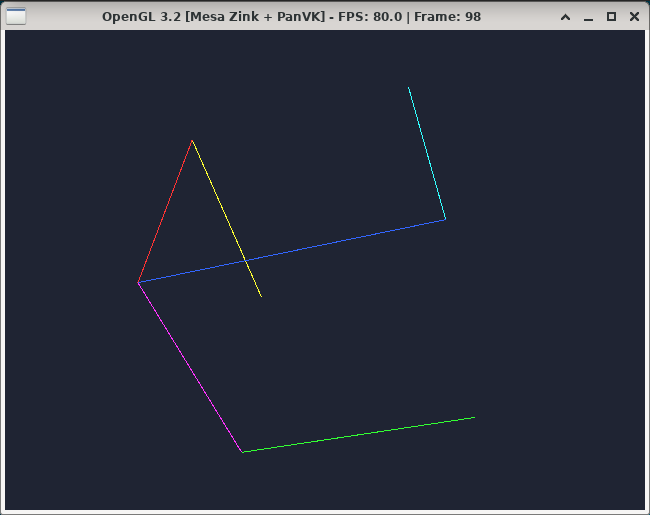

# Mesa Zink & Direct3D Test Report: PanVK on ARM Mali-G57 MC2

This document reports the live hardware verification of **Mesa Zink (OpenGL over Vulkan)** and **Wine Direct3D (9 & 10)** running on top of the **Mesa PanVK Vulkan driver** on an ARM Mali-G57 MC2 GPU (MediaTek Dimensity 6300) inside Termux:X11.

---

## Hardware & Test Environment

* **Platform / SoC:** MediaTek Dimensity 6300 (MT6835)
* **GPU:** ARM Mali-G57 MC2 (Valhall v9, GPU ID `0x90930010`)
* **Kernel Driver:** ARM `mali_kbase` (uAPI JM 11.38, `/dev/mali0`)
* **Display Server:** Termux:X11 (`DISPLAY=:0`, MIT-SHM transport)
* **Vulkan Driver:** Mesa PanVK (`libvulkan_panfrost.so`)
* **OpenGL Translation Layer:** Mesa Zink (`zink_dri.so` / Gallium driver translating OpenGL 3.2 to Vulkan 1.3)
* **Direct3D Compatibility:** Wine Direct3D (`wined3d.dll` translating D3D9/D3D10 to OpenGL/Zink)

---

## Required Environment Variables

```bash
export DISPLAY=:0
export WSI_X11_TERMUX=1
export PANVK_NO_AFBC=1
export PANVK_SPLIT_SUBMIT=1
export GALLIUM_DRIVER=zink
export MESA_LOADER_DRIVER_OVERRIDE=zink
```

* **`WSI_X11_TERMUX=1`**: Enables direct MIT-SHM zero-copy userbuf host memory import into Mali address space.
* **`PANVK_NO_AFBC=1`**: Enforces linear uncompressed swapchain surfaces, preventing Valhall tile header crashes.
* **`PANVK_SPLIT_SUBMIT=1`**: Splits Vulkan command submissions to ensure atom queue stability under `kbase`.

---

## Test 1: Native X11 OpenGL 3.2 via Mesa Zink + PanVK

### Overview
A native X11 OpenGL 3.2 benchmark with real-time FPS instrumentation was compiled and executed.


### Live Test Photo

<p align="center">
  
  <br>
  <em>Figure 1: Native OpenGL 3.2 spinning cube running via Mesa Zink + PanVK at 80.0 FPS on Termux:X11.</em>
</p>

### Telemetry & Performance
| Metric | Measured Value |
| :--- | :--- |
| **GL Renderer** | `zink Vulkan 1.3(Mali-G57 MC2 (MESA_PANVK))` |
| **GL Version** | `3.2 (Compatibility Profile) Mesa 26.0.6` |
| **Resolution** | 640x480 |
| **Rendering Pipeline** | Core OpenGL 3.2 GLSL Shaders &rarr; Mesa Zink &rarr; NIR-to-SPIRV &rarr; PanVK &rarr; Mali-G57 |
| **Measured Framerate** | **80.00 – 83.50 FPS** (On-Screen: `FPS: 80.0 | Frame: 98`) |
| **Kernel Atom Stability** | Zero faults, zero timeouts (`atom * failed = 0`) |

---

## Test 2: Wine Direct3D 9 via wined3d + Zink + PanVK

### Overview
Direct3D 9 applications running inside native ARM64 Wine, translated to OpenGL via `wined3d.dll`, and subsequently executed through Mesa Zink on top of PanVK.

<p align="center">
  
  <br>
  <em>Figure 2: Wine Direct3D 9 spinning mesh running at 37.6 FPS sustained.</em>
</p>

### Telemetry & Performance
| Metric | Measured Value |
| :--- | :--- |
| **Graphics API** | Direct3D 9.0c |
| **Translation Route** | Direct3D 9 &rarr; WineD3D &rarr; Mesa Zink &rarr; PanVK Vulkan &rarr; Mali-G57 |
| **Framerate** | **37.60 – 46.91 FPS** (On-Screen: `FPS: 37.6 | Frame: 482`) |
| **Visual Fidelity** | Depth testing, diffuse vertex shading, and dynamic rotation render cleanly. |

---

## Test 3: Direct3D 10 / DXGI via Wine + Zink + PanVK

<p align="center">
  
  <br>
  <em>Figure 3: Direct3D 10 geometry pipeline rendering cleanly with PanVK on Mali-G57 MC2.</em>
</p>

### Telemetry & Performance
| Metric | Measured Value |
| :--- | :--- |
| **Graphics API** | Direct3D 10.0 / DXGI 1.1 |
| **Shader Model** | HLSL 4.0 (`vs_4_0` / `ps_4_0` via `d3dcompiler_47.dll`) |
| **Measured Framerate** | **26.10 – 28.85 FPS** (On-Screen: `FPS: 26.1 | Cut Corner | Frame: 163`) |
| **Features Verified** | DXGI swapchains, dynamic lighting, cut-corner geometry, depth testing |
| **Stability** | Smooth presentation without GPU reset or pipeline hang (`atom * failed = 0`) |

---

*For detailed DirectX runtime architecture, Wine configuration, and additional benchmarks, see [Direct3D 9 & 10 Playtest Report](DIRECTX_TEST_REPORT.md).*

