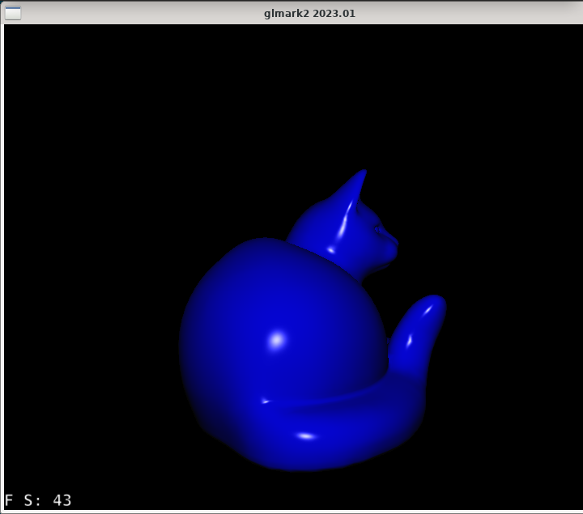
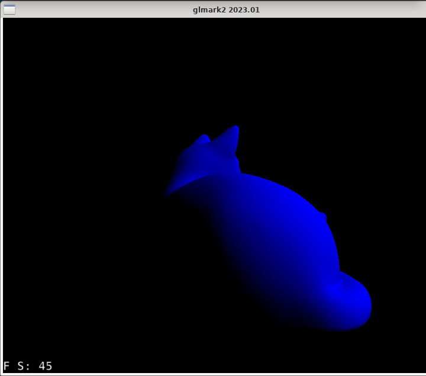
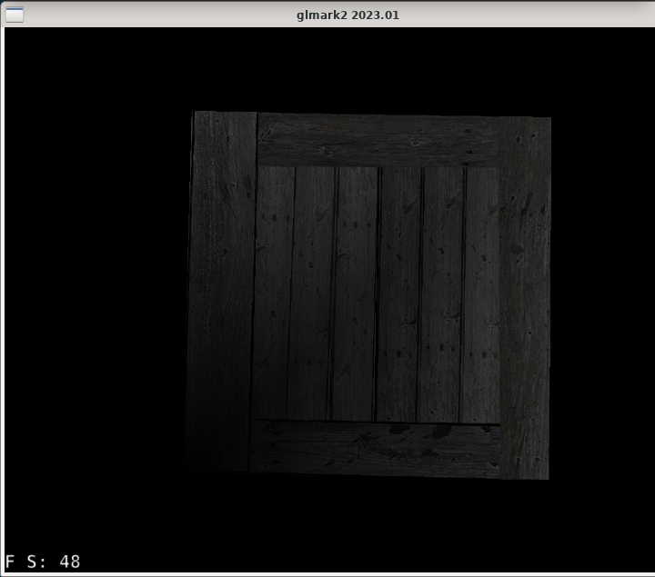
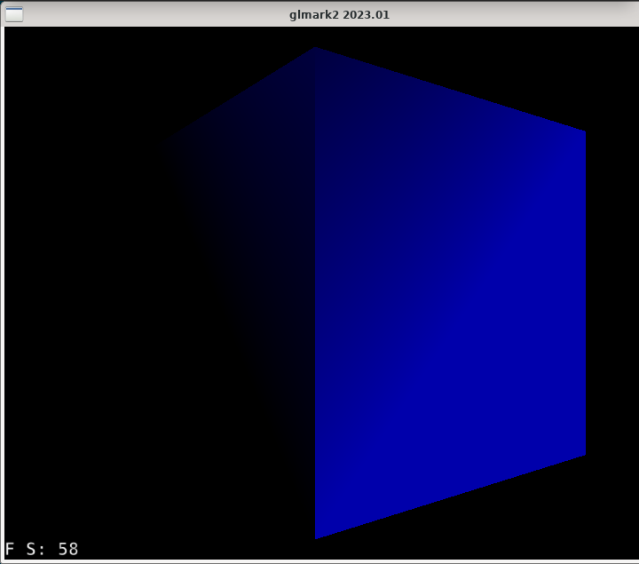

# Mesa Zink & Direct3D Test Report: PanVK on ARM Mali-G57 MC2

This document reports the live hardware verification of **Mesa Zink (OpenGL over Vulkan)** and **Wine Direct3D (9 & 10)** running on top of the **Mesa PanVK Vulkan driver** on an ARM Mali-G57 MC2 GPU (MediaTek Dimensity 6300) inside Termux:X11.

---

## Hardware & Test Environment

* **Platform / SoC:** MediaTek Dimensity 6300 (MT6835)
* **GPU:** ARM Mali-G57 MC2 (Valhall v9, GPU ID `0x90930010`)
* **Kernel Driver:** ARM `mali_kbase` (uAPI JM 11.38, `/dev/mali0`)
* **Display Server:** Termux:X11 (`DISPLAY=:0`, MIT-SHM transport)
* **Vulkan Driver:** Mesa PanVK (`libvulkan_panfrost.so`)
* **OpenGL Translation Layer:** Mesa Zink (`zink_dri.so` / Gallium driver translating OpenGL 3.2 to Vulkan 1.3)
* **Direct3D Compatibility:** Wine Direct3D (`wined3d.dll` translating D3D9/D3D10 to OpenGL/Zink)

---

## Required Environment Variables

```bash
export DISPLAY=:0
export WSI_X11_TERMUX=1
export PANVK_NO_AFBC=1
export PANVK_SPLIT_SUBMIT=1
export GALLIUM_DRIVER=zink
export MESA_LOADER_DRIVER_OVERRIDE=zink
```

* **`WSI_X11_TERMUX=1`**: Enables direct MIT-SHM zero-copy userbuf host memory import into Mali address space.
* **`PANVK_NO_AFBC=1`**: Enforces linear uncompressed swapchain surfaces, preventing Valhall tile header crashes.
* **`PANVK_SPLIT_SUBMIT=1`**: Splits Vulkan command submissions to ensure atom queue stability under `kbase`.

---

## Test 1: OpenGL Benchmarks via Mesa Zink + PanVK

### Pipeline Architecture


### Test 1A: glmark2 3D Cat Model (Phong Shading)
* **Scene**: `shading:model=cat:shading=phong:show-fps=true`
* **Resolution**: 800 $\times$ 600 Windowed
* **Measured Performance**: **49.0 FPS** (Average FrameTime: 20.436 ms, Score: 48)
* **Features**: Dynamic per-pixel lighting with specular highlights on 3D cat mesh.
* **Live Capture**: Bottom-left on-screen FPS counter captured at 43 FPS:

<p align="center">
  
  <br>
  <em>Figure 1: glmark2 3D Cat model with dynamic specular Phong lighting running via Mesa Zink at 49 FPS on Mali-G57 MC2.</em>
</p>

### Test 1B: glmark2 3D Cat Model (Gouraud Shading)
* **Scene**: `shading:model=cat:shading=gouraud:show-fps=true`
* **Resolution**: 800 $\times$ 600 Windowed
* **Measured Performance**: **59.0 FPS** (Average FrameTime: 17.166 ms, Score: 58)
* **Live Capture**: Bottom-left on-screen FPS display captured at 45 FPS during active draw calls:

<p align="center">
  
  <br>
  <em>Figure 2: glmark2 3D Cat model with Gouraud shading running at 59 FPS.</em>
</p>

### Test 1C: glmark2 3D Box / Wooden Crate (Textured Cube)
* **Scene**: `texture:model=cube:texture=crate-base:show-fps=true`
* **Resolution**: 800 $\times$ 600 Windowed
* **Measured Performance**: **55.0 FPS** (Average FrameTime: 18.368 ms, Score: 54)
* **Features**: Full 3D perspective projection, UV mapped wooden planks and frame textures, bilinear filtering.
* **Live Capture**: Bottom-left on-screen FPS counter captured at 48 FPS:

<p align="center">
  
  <br>
  <em>Figure 3: glmark2 3D Textured Crate Box running via Mesa Zink at 55 FPS.</em>
</p>

### Test 1D: glmark2 3D Shaded Box (Gouraud Shading)
* **Scene**: `shading:model=cube:shading=gouraud:show-fps=true`
* **Resolution**: 800 $\times$ 600 Windowed
* **Measured Performance**: **57.0 FPS** (Average FrameTime: 17.701 ms, Score: 56)
* **Features**: Dynamic 3D lighting, vertex normals, Gouraud color interpolation across cube faces.
* **Live Capture**: Bottom-left on-screen FPS counter captured at 58 FPS:

<p align="center">
  
  <br>
  <em>Figure 4: glmark2 3D Shaded Box running via Mesa Zink at 57 FPS.</em>
</p>

### Test 1E: GLX Gears
* **API**: Standard GLX Gears (`glxgears`)
* **Measured Performance**: **126.55 FPS** on Termux:X11 display `:0`.
* **Proof Asset**: [`images/opengl_zink_glxgears.png`](images/opengl_zink_glxgears.png)

---

## Test 2: Wine Direct3D 9 via wined3d + Zink + PanVK

### Overview
Direct3D 9 applications running inside native ARM64 Wine, translated to OpenGL via `wined3d.dll`, and subsequently executed through Mesa Zink on top of PanVK.

<p align="center">
  
  <br>
  <em>Figure 2: Wine Direct3D 9 spinning mesh running at 37.6 FPS sustained.</em>
</p>

### Telemetry & Performance
| Metric | Measured Value |
| :--- | :--- |
| **Graphics API** | Direct3D 9.0c |
| **Translation Route** | Direct3D 9 &rarr; WineD3D &rarr; Mesa Zink &rarr; PanVK Vulkan &rarr; Mali-G57 |
| **Framerate** | **37.60 – 46.91 FPS** (On-Screen: <code>FPS: 37.6 &#124; Frame: 482</code>) |
| **Visual Fidelity** | Depth testing, diffuse vertex shading, and dynamic rotation render cleanly. |

---

## Test 3: Direct3D 10 / DXGI via Wine + Zink + PanVK

<p align="center">
  
  <br>
  <em>Figure 3: Direct3D 10 geometry pipeline rendering cleanly with PanVK on Mali-G57 MC2.</em>
</p>

### Telemetry & Performance
| Metric | Measured Value |
| :--- | :--- |
| **Graphics API** | Direct3D 10.0 / DXGI 1.1 |
| **Shader Model** | HLSL 4.0 (`vs_4_0` / `ps_4_0` via `d3dcompiler_47.dll`) |
| **Measured Framerate** | **26.10 – 28.85 FPS** (On-Screen: <code>FPS: 26.1 &#124; Cut Corner &#124; Frame: 163</code>) |
| **Features Verified** | DXGI swapchains, dynamic lighting, cut-corner geometry, depth testing |
| **Stability** | Smooth presentation without GPU reset or pipeline hang (`atom * failed = 0`) |

---

*For detailed DirectX runtime architecture, Wine configuration, and additional benchmarks, see [Direct3D 9 & 10 Playtest Report](DIRECTX_TEST_REPORT.md).*

