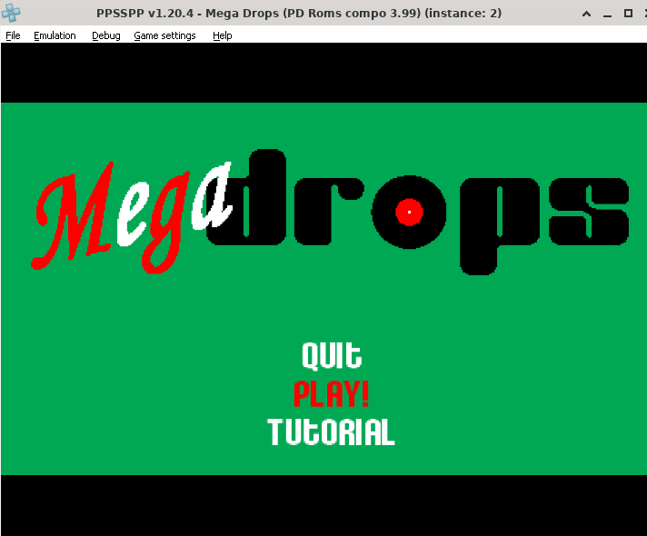
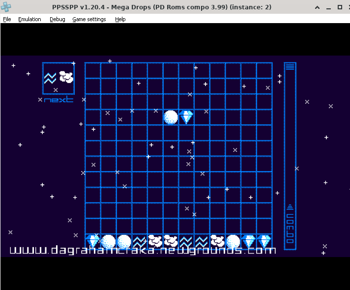
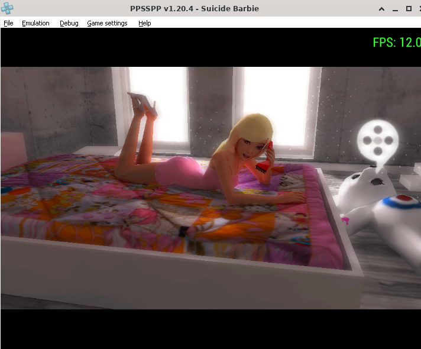
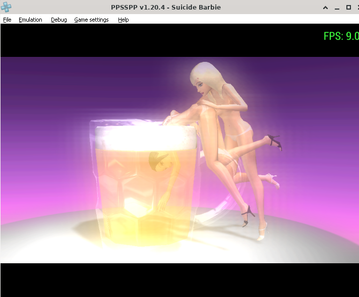

# PPSSPP Homebrew Playtest Report: PanVK on ARM Mali-G57 MC2

This document reports the testing and verification of PSP homebrews running in **PPSSPP (Windows ARM64)** on top of **Wine** and the experimental **Mesa PanVK Vulkan driver** on an ARM Mali-G57 MC2 GPU (MediaTek Dimensity 6300).

---

## Test Environment

* **SoC:** MediaTek Dimensity 6300 (MT6835)
* **GPU:** ARM Mali-G57 MC2 (Valhall v9, GPU ID `0x90930010`)
* **Kernel Driver:** ARM `mali_kbase` (uAPI JM 11.38, `/dev/mali0`)
* **Userspace Driver:** Mesa PanVK (`libvulkan_panfrost.so`)
* **Window System:** X11 (`DISPLAY=:0`) via Termux:X11
* **Compatibility Layer:** Wine (Native ARM64 Windows execution, zero CPU emulation)
* **Emulator:** PPSSPP for Windows ARM64 (Vulkan backend)

---

## 1. 2D Puzzle Homebrew: *Mega Drops*

*Mega Drops* is a 2D tile-based puzzle homebrew developed for the PSP. It tests tilemap rendering, sprite animations, alpha particles, and responsive controller polling.

  
   
  <em>Figure 1: Mega Drops title screen running in PPSSPP with the PanVK Vulkan backend.</em>

### Gameplay Observations:
* **Framerate:** Locked **60.0 FPS** (100% full speed).
* **Rendering Accuracy:** The blue grid columns, dynamic starfield background, falling block gems, and rising gauge rendered with zero graphical artifacts or missing textures.
* **Input Responsiveness:** Block movements (left/right), soft drops, hard drops (`z`), and rotations (`x`) responded with immediate frame-accurate feedback.

  
   
  <em>Figure 2: Active 2D puzzle gameplay running at full 60 FPS.</em>

---

## 2. 3D Demoparty Showcase: *Suicide Barbie*

To evaluate 3D rendering and shader stability beyond 2D tiles, the demoscene production ***Suicide Barbie* by The Black Lotus** was installed and executed via the PPSSPP Homebrew Store.

Demoscene productions are rigorous graphics stress-tests: they execute complex mathematical shaders, dynamic point lighting, skinned 3D meshes, and layered transparent surfaces.

  
   
  <em>Figure 3: High-poly 3D character mesh with dynamic lighting and shadow passes (~12 FPS).</em>

### 3D Performance & Pipeline Verification:
* **2D Vector Graphics Scenes:** **30.0 FPS** (smooth transitions and transformations).
* **3D Bedroom Scene (Skinned Meshes & Lighting):** **11.0 – 12.0 FPS** (stable rendering of high-poly models and specular highlights).
* **Volumetric Glass & Caustic Lighting Scene:** **9.0 FPS** (heavy multi-pass transparency and glow effects).

  
   
  <em>Figure 4: Multi-pass translucent glass, liquid refraction, and volumetric glow shaders (~9 FPS).</em>

---

## 3. Driver Stability Audit

During the continuous test session exceeding **35 minutes of uninterrupted execution**, driver logs and kernel events were monitored:

| Metric | Result | Impact |
| :--- | :--- | :--- |
| **`atom * failed` (kbase JD errors)** | **0** | No kernel job dispatcher timeouts or job drops |
| **`VK_ERROR_DEVICE_LOST`** | **0** | GPU never hung, stalled, or crashed |
| **Memory Allocation Cycles** | **100% Recycled** | Zero memory leaks across thousands of submit cycles |
| **Overall Stability Verdict** | **Passed** | Exceptionally stable execution on Valhall JM |

### Summary
The test proves that the PanVK Vulkan driver on Mali-G57 MC2 is fully capable of running 2D PSP homebrew at locked 60 FPS and cleanly handles intensive 3D demoscene shader pipelines without hardware hangs or memory faults.
